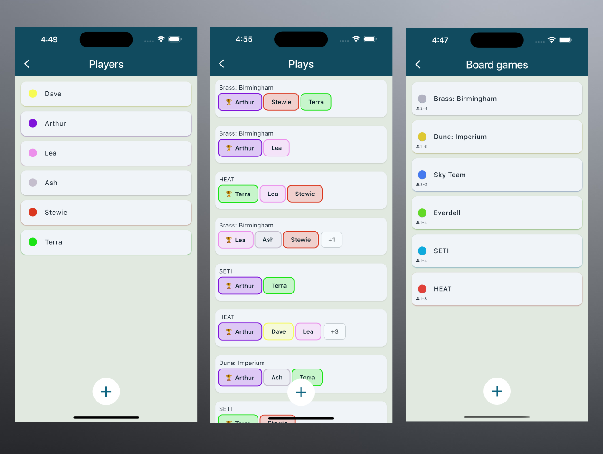
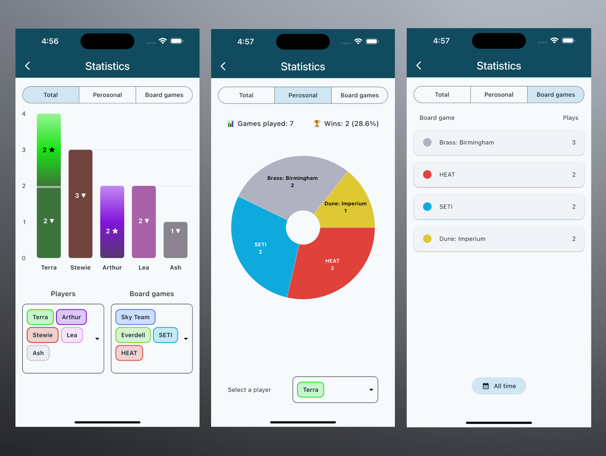

# BG-Stat

A lightweight board game plays tracker built with Flutter. Designed for local collections, quick session logging, and clean stats without account signup or cloud dependency.

**Game plays tracking**

**Stats visualization**

## Currently supported features

- Track board games, players, and play sessions
- Fast session entry with scores, winners, and dates
- Custom colors for games and players
- Offline-first local storage
- Session history and statistics
- Data visualization

## Planned features

- Random game picker for choosing what to play
- P2P session syncing
- Prettier UI and improved UX

## Tech

- Dart, Flutter
- BLoC state management
- Local database persistence

## Goal

Simple, fast, private board game logging focused on actual table use rather than social features or account systems.
